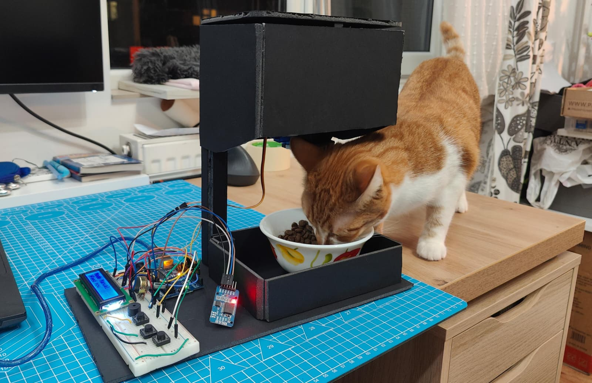
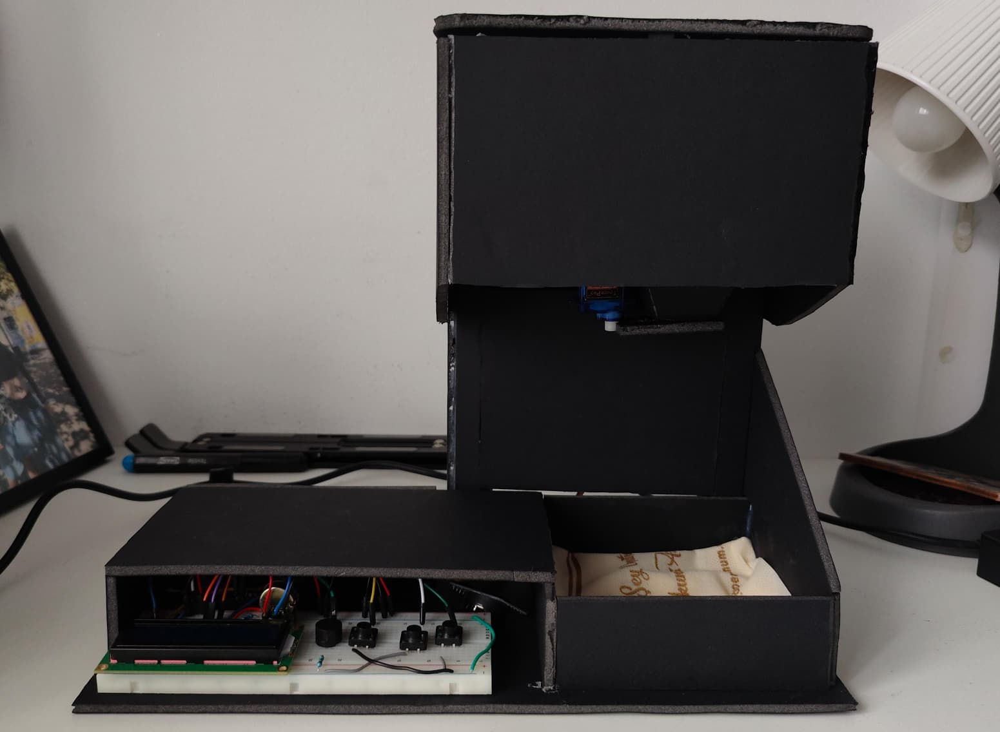

# CatFeeder
Robotics project, automated cat feeder with interactive menu

My project is an automated cat feeder controlled by an Arduino. It allows users to schedule feeding times or time intervals through an interactive LCD menu, or you can set it to manual and press a button to feed the cat. The system will use an RTC module for accurate timekeeping, a servo motor to open or close the food hatch, and optional LEDs and a buzzer to alert the cat when food is served. The physical housing will be made from cardboard or similar lightweight material. The feeder dispenses food automatically without human intervention once configured. For complexity, I can also add a scale (load cell + HX711 amplifier) to measure the amount of food dispensed is as set from the menu.

 ### Components  

* **1 × Arduino UNO**   
* **1 × 16x2 LCD** (HD44780 or compatible)
* **1 × RTC Module**  (DS3231 or DS1307)
* **1 x Servo Motor**
* **3 x Push Buttons**
* **1 × EEPROM** (built-in) 
* **1 × Buzzer**
* ** Foamboard Housing **
* **Resistors and wiring as required**

System boundary: the electronics, software, and mechanical dispenser form the internal system, while the cat remains external (but not needed for testing the feeder).

Where intelligence lives: intelligence is in the Arduino code, which manages scheduling, user input, and actuator control.

Hardest technical problem: the servo mechanics syncronizatoin, especially if weight measurement is added.

Minimum demo: setting a feeding time and having the servo open the hatch at that moment.

Why it’s not just a tutorial: because the design combines scheduling, UI, manual mode, alerts, and (maybe) weight sensing in a customized system rather than following a single recipe.
